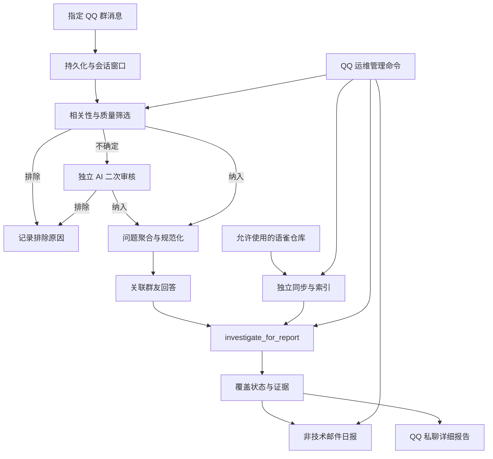

# 南京大学迎新问答采集与知识缺口日报插件实施计划

> 日期：2026-07-13
> 状态：实现中（基础采集、AI 自动复核、历史批处理、脱敏查询与累计导出已完成）
> 目标平台：AstrBot / QQ 群聊 / 语雀知识空间

## 1. 项目目标

新建一个独立 AstrBot 插件，从指定 QQ 群的日常消息中识别与南京大学学习、生活、办事和校园服务有关的有效问题，聚合同一问题，关联群友给出的回答，并使用独立的知识库调查 Agent 检查允许使用的语雀仓库是否已有可用资料。

插件每天固定时间生成面向非技术知识库维护人员的日报。日报包含：

1. 经过范围和质量筛选的全部聚合问题；
2. 脱敏后的原始提问样本；
3. 群友回答摘要及脱敏样本（没有回答时明确写“未发现群友回答”）；
4. 知识库调查结论、实际资料引用和缺失信息；
5. 面向维护人员的补充或核实建议；
6. 每个问题的唯一编号，以及私聊机器人查看详细报告的中文指令。

插件的最终目的不是替群友即时回答，而是帮助维护人员发现“南哪知识库应该覆盖、但当前资料不足或可能过期”的问题。

## 2. 明确边界

### 2.1 与现有 `astrbot_plugin_nju_qa` 的关系

- 新插件不导入、不调用、不依赖现有 `nju_qa` 插件实例。
- 从现有插件复制并改造必要的语雀同步、文档存储、分块、向量索引、检索工具和 Agent 调用思路。
- 新插件维护自己的配置、Markdown 文档、SQLite 数据库、分块索引和向量索引。
- 对话模型默认复用 AstrBot 当前默认 Provider；Embedding 使用与现有插件同名的 OpenAI-compatible 配置，但本插件拥有独立的并发、重试、超时和批处理限制。
- 现有插件的群聊限流不作用于新插件；两者只可能共同受到上游模型供应商总额度限制。

### 2.2 知识范围与数据来源

- `https://www.yuque.com/greatnju/q-a2.0` 只用于定义“南哪知识库应关注的问题类型”和分类参考，不作为本插件的实际检索数据源。
- 实际语雀空间为 `https://nova.yuque.com/qc19gt`。
- `qc19gt/ogaye8` 是当前 QA 成品仓库，默认加入“排除仓库”配置，避免用已有答案仓库反向证明它自身没有缺口。
- QA 仓库不是代码中的永久禁用常量。管理员可以修改排除配置；取消排除后，仓库先进入待批准状态，不自动下载。
- 只有明确批准的仓库可以下载正文、建立索引并成为调查证据来源。

### 2.3 不做的事情

- 不在群聊中自动发布调查结果或自动回复用户。
- 不把群友回答当作知识库可靠证据。
- 不自动修改或发布语雀文档。
- 不因检索失败、超时或步数耗尽而宣布“知识库没有答案”。
- 不把技术运行信息、原始 QQ 消息 ID、模型调用轨迹或异常堆栈写入非技术日报。

## 3. 总体流程



每日处理按自然日窗口执行，例如在 03:30 处理前一日 `00:00:00–23:59:59` 的消息。系统使用持久化水位线和幂等键，避免重启后漏报或重复发报，而不是简单读取“当前时间往前 24 小时”。

## 4. 插件目录设计

计划创建独立仓库或目录 `astrbot_plugin_nju_qa_report`：

```text
astrbot_plugin_nju_qa_report/
├─ main.py
├─ metadata.yaml
├─ _conf_schema.json
├─ requirements.txt
├─ README.md
├─ nju_report/
│  ├─ config.py
│  ├─ permissions.py
│  ├─ models.py
│  ├─ storage.py
│  ├─ message_capture.py
│  ├─ scope_classifier.py
│  ├─ question_aggregator.py
│  ├─ answer_linker.py
│  ├─ anonymizer.py
│  ├─ scheduler.py
│  ├─ jobs.py
│  ├─ report_service.py
│  ├─ mailer.py
│  ├─ admin_service.py
│  ├─ yuque/
│  │  ├─ client.py
│  │  ├─ repository_policy.py
│  │  ├─ sync_service.py
│  │  ├─ document_store.py
│  │  └─ repository_registry.py
│  └─ investigation/
│     ├─ agent.py
│     ├─ prompts.py
│     ├─ index.py
│     ├─ retriever.py
│     ├─ evidence.py
│     └─ tools.py
├─ templates/
│  ├─ email_summary.html
│  └─ report_detail.html
└─ tests/
   ├─ fixtures/
   ├─ unit/
   └─ integration/
```

`main.py` 只负责 AstrBot 生命周期、事件监听和命令注册，业务逻辑放在可独立测试的服务中。

## 5. 配置设计

所有敏感值通过 AstrBot 插件配置保存，不写入仓库。QQ 号码按字符串处理，避免精度或前导格式问题。

### 5.1 消息采集

```text
capture_enabled
capture_mode = selected_groups | all_group_messages
target_group_ids = ["..."]
group_aliases = {"群号": "南大迎新群一"}
timezone = "Asia/Shanghai"
raw_message_retention_days = 90
```

默认只处理 `target_group_ids`。忽略 Bot 自己发送的消息、系统通知、纯附件事件和命令消息，但保留回复关系及必要的上下文元数据。

### 5.2 模型与批处理

```text
llm_provider_id
embedding_api_key
embedding_base_url
embedding_model = "text-embedding-3-small"
enable_vector_search = true
batch_concurrency
request_timeout_seconds
max_retries
investigation_max_steps
investigation_max_tool_calls
scope_auto_review_enabled = true
scope_auto_review_max_rounds = 2
```

Provider ID 可以配置成与现有问答插件一致；留空时采用约定的 AstrBot 默认 Provider。插件使用自己的信号量和重试器。

### 5.3 语雀仓库

```text
yuque_base_url = "https://nova.yuque.com"
yuque_token
yuque_space_login = "qc19gt"
approved_repositories = []
excluded_repositories = [
  {"namespace": "qc19gt/ogaye8", "reason": "QA 成品仓库，默认不作为缺口调查源"}
]
auto_discover_repositories = true
new_repository_policy = "pending"
purge_excluded_repository_data = true
sync_schedule
full_reconcile_schedule
```

策略优先级为：`excluded > disabled > pending > approved`。排除仓库不得下载正文或参与检索；开启清理时还要删除历史 Markdown、SQLite 记录、分块和向量。

### 5.4 权限

```text
report_viewer_qq_ids = []
operator_qq_ids = []
inherit_astrbot_admins_as_viewers = true
inherit_astrbot_admins_as_operators = true
sensitive_commands_private_only = true
```

- 报告查看人员：可以查看脱敏日报和单个问题详情。
- 运维管理员：可以同步仓库、执行调查、重跑或发送日报、查看错误和技术状态。
- AstrBot 管理员是否自动继承两种权限分别可配。
- 邮件收件人不会自动获得 QQ 查询权限，因为邮箱与 QQ 身份无法可靠对应。
- 所有敏感命令默认只能私聊执行；群聊调用时只提示用户私聊机器人。

### 5.5 日报与邮件

```text
daily_report_enabled
daily_report_time = "03:30"
smtp_host
smtp_port
smtp_username
smtp_password
smtp_use_ssl
mail_from
mail_recipients = []
mail_subject_prefix = "NJU 知识库日报"
attach_full_html = true
attach_summary_csv = false
```

## 6. 数据模型与审计

使用独立 SQLite 数据库并启用 WAL。核心数据表：

- `messages`：群、发送者内部标识、时间、文本、回复关系、Bot/系统标记。
- `processing_windows`：日报日期、起止时间、水位线和处理状态。
- `question_candidates`：初筛决定、AI 二次审核决定、理由、清晰度及知识价值。
- `scope_review_runs`：每次自动审核的输入摘要、模型输出、置信度和最终裁决。
- `question_clusters`：日报问题编号、AI 聚合问题、分类、时间范围、出现次数。
- `cluster_messages`：聚合问题与原始消息的关联及样本优先级。
- `community_answers`：回答消息、与问题的关联置信度、是否存在冲突。
- `repositories`：发现状态、批准状态、排除原因和最后同步信息。
- `documents` / `chunks`：本地知识文档、正文哈希和索引元数据。
- `investigation_runs`：每次调查的完成状态、工具执行摘要、失败原因。
- `evidence_items`：实际读过的文档、相关章节、URL 和支持范围。
- `report_items` / `reports`：冻结后的日报内容和版本。
- `jobs` / `mail_deliveries`：后台任务、重试和邮件发送结果。

日报问题编号采用 `YYYYMMDD-QNNN`，例如 `20260712-Q001`。编号在报告生成后保持稳定，重跑时沿用原编号；新增问题只追加编号，不重排旧编号。

原始 QQ 消息 ID 仅保存在本地审计数据中。需要跨表追踪时生成 HMAC 内部追踪标识，但该标识不出现在邮件和普通查看命令中。

## 7. 问题筛选和 AI 聚合规则

### 7.1 两阶段处理

先判断问题是否值得进入“南哪知识库补充”流程，再对纳入的问题进行聚合。不能使用“当前知识库是否搜得到答案”作为前置筛选条件。

初次筛选结果：

- `INCLUDE（纳入）`：属于南京大学学习、生活、办事、校园服务或新生适应范围，问题结合上下文后足够明确，并具有重复答疑或知识维护价值。
- `AUTO_REVIEW（自动复核）`：可能相关，但上下文、意图或知识价值仍不确定，交给独立 AI 审核流程，不产生人工队列。
- `DROP（排除）`：闲聊、玩笑、广告、临时交易、私人事务、无关话题、纯情绪、Bot 命令，或者结合上下文仍无法形成明确问题。

参考知识库只提供主题分类和正反例。口语化、错别字、没有年级、没有年份或没有校区都不是排除理由。

自动复核使用独立提示词重新读取原始消息及必要上下文，不直接照抄初筛理由。审核目标是确认问题是否清楚、是否属于南哪知识库合理范围、是否具有可沉淀价值：

- 审核确定相关且清楚：转为 `INCLUDE`；
- 审核确定无关、低质量或无法还原：转为 `DROP`；
- 达到配置的审核轮次后仍无法确认：自动转为 `DROP_LOW_CONFIDENCE`，保留本地审核原因，不要求管理员查看，也不进入邮件。

系统保留聚合后的数量统计和自动审核审计记录，便于以后通过离线测试调整规则，但日常运行没有人工复核步骤。

### 7.2 聚合规则

- 根据核心求助意图聚合，不只按关键词相似度。
- 只保留聊天中确实出现且会影响答案的年级、年份、校区等限定条件。
- 不得补造缺失信息。
- 答案会因校区、年份或培养类型显著变化时拆开。
- 聚合置信度较低时宁可拆分，避免掩盖不同知识缺口。
- 聚合后的问题必须脱离原聊天也能独立理解。
- 重复问题记录出现次数、群聊别名和时间范围，而不是简单删除。

推荐结构化输出：

```json
{
  "scope_decision": "INCLUDE",
  "scope_reason": "属于南京大学转专业政策与办理问题",
  "canonical_question": "软件学院转专业一般需要参加哪些考核？",
  "category": "学业与培养/转专业",
  "clarity": "CLEAR",
  "knowledge_value": "HIGH",
  "time_sensitive": true,
  "auto_reviewed": false
}
```

## 8. 群友回答关联

回答识别同时使用：

1. QQ 原生回复关系；
2. 问题之后的时间邻近性；
3. 对话参与关系；
4. 回答内容与聚合问题的语义对应；
5. 后续追问、确认或反驳。

低置信度消息不强行归为回答。不同群友的冲突说法都保留并标记“群友说法存在分歧”。群友回答在报告中明确标为未经核实，只用于帮助维护人员理解群内已有认知，不能提升知识库覆盖状态。

## 9. 语雀同步与仓库安全策略

### 9.1 仓库发现

- 使用运行时 Token 尝试空间对应的团队仓库接口；必要时回退用户仓库接口。
- 仓库扫描只读取元数据，不自动拉取正文。
- 新发现仓库进入 `PENDING`，由管理员执行批准命令后才允许同步。

### 9.2 同步

- 同步前再次执行仓库策略检查。
- 根据 TOC 和文档更新时间判断新增、修改和删除；元数据不可靠时回退到正文拉取和哈希比较。
- 只对正文变化的文档重新分块和建立向量。
- 定期执行全量校验，修复增量同步可能遗漏的变化。
- 仓库被禁用或排除后，按配置清除它在 Markdown、SQLite、分块和向量存储中的全部历史数据。
- 检索层每次查询仍按允许仓库列表过滤，防止历史残留越权进入结果。

这修复现有插件中“从配置移除整个 namespace 后，旧数据可能继续留在本地索引中”的风险。

## 10. 独立知识库调查 Agent

### 10.1 单一入口

业务层只调用：

```text
investigate_for_report(question, context, allowed_repositories, snapshot_id)
```

该入口内部创建只属于本插件的 ToolSet。工具不注册为全局聊天工具，避免与现有插件重名或被普通会话调用。

### 10.2 Agent 可自主使用的工具

- `search_documents`：标题、正文、BM25 和向量混合检索。
- `grep_documents`：跨允许仓库做全文关键词或安全正则检索。
- `list_repository_tree`：查看仓库目录和相邻主题。
- `read_document`：读取候选文档正文和元数据。
- `find_related_documents`：根据已读文档寻找同目录、引用或相似文档。

不规定必须先 BM25、再向量、最后 grep。Agent 根据问题自主改写查询、全文 grep、阅读候选文档和追踪相关章节。混合检索用于召回语义相近内容，grep 用于找专有名词、系统名、文件名、旧称和精确表述，两者互补。

### 10.3 调查完成契约

只有同时满足以下条件，才允许给出 `NO_USABLE_EVIDENCE`：

- 调查任务正常完成，没有工具异常或超时；
- 未达到步数或工具调用上限；
- 对问题使用过多个有实质差异的查询表达；
- 使用过语义/关键词检索和全文 grep；
- 已读取并判断主要候选文档，而不只看搜索摘要；
- 多子问题均已分别调查；
- 最终没有找到能够支持回答的可靠资料。

条件不满足时只能返回 `INCOMPLETE` 或 `ERROR`，不得向维护人员暗示知识库确定存在缺口。

### 10.4 覆盖状态

- `ANSWERABLE｜可找到明确回答`：允许仓库中有足够、直接且未明显过期的资料。
- `PARTIAL｜找到部分相关资料`：存在相关资料，但缺少关键条件、步骤、时效或部分子问题。
- `NO_USABLE_EVIDENCE｜暂未找到可用知识`：深度调查完整结束后仍无可靠证据。
- `INCOMPLETE｜调查未完成`：调查因上限、依赖不可用或覆盖不足而未完成，不能判断是否为缺口。
- `ERROR｜调查发生错误`：同步、模型或工具执行失败，不能判断是否为缺口。

`STALE_RISK（资料可能过期）`、`COMMUNITY_CONFLICT（群友说法冲突）`、`TIME_SENSITIVE（时效性强）` 等作为附加标记，不替代主状态。

### 10.5 “引用”的含义

详细报告中的引用只指知识库证据来源，不是 QQ 消息内部编号。每条引用包含：

- 仓库显示名；
- 文档标题；
- 相关章节标题；
- 语雀文档 URL；
- 与本问题相关的简短内容概述；
- 文档更新时间或本地同步时间。

邮件不暴露原始 QQ message ID、HMAC 追踪号或工具调用记录。

## 11. 日报设计

### 11.1 邮件主题

```text
[NJU 知识库日报][2026-07-12] 问题28｜无可用知识6｜部分覆盖9｜资料可能过期3
```

### 11.2 邮件正文

1. 报告日期、采集群聊别名和有效问题总数；
2. 中文状态统计及解释，例如：
   - 可找到明确回答：10 个（知识库已有足够资料）；
   - 找到部分相关资料：9 个（有相关内容，但缺少关键信息）；
   - 暂未找到可用知识：6 个（深度调查完成后仍无可靠证据）；
   - 调查未完成或发生错误：3 个（不能判断是否为知识库缺口）；
3. 建议优先处理的问题：高频、部分覆盖、无可用知识、资料可能过期、群友说法冲突；
4. 所有纳入问题的一行简报；
5. 私聊机器人查看具体问题报告的指令提示。

一行简报格式：

```text
编号｜分类｜中文覆盖状态｜AI 聚合问题｜群友回答简述｜知识库结论｜维护建议
```

示例：

```text
20260712-Q001｜教务·转专业｜找到部分相关资料｜软件学院转专业需要参加哪些考核？｜群友称往年有机试和面试，但未提供正式通知｜只有往年经验，缺少当前规定｜补充最新准入通知
```

邮件末尾固定显示：

```text
想查看某个问题的详细报告，请私聊迎新机器人发送：
/南哪日报 查看 20260712-Q001

也可以查看当日问题列表：
/南哪日报 列表 2026-07-12
```

正文不显示 Provider、索引统计、任务 ID、工具 JSON、数据库状态或异常堆栈。默认附加一份完整脱敏 HTML 报告；结构化 JSON 只保存在本地，CSV 是否附加由配置决定。

### 11.3 单个问题详细报告

- 日报问题编号和 AI 聚合问题；
- 分类、出现次数、群聊别名、时间范围、聚合置信度；
- 3–5 条有代表性的脱敏原始提问；
- 群友回答摘要及 3–5 条脱敏回答样本；
- 群友回答是否冲突；
- 中文知识库覆盖状态；
- 找到了什么资料及引用；
- 仍缺少什么信息；
- 维护建议；
- 若调查未完成，使用非技术语言说明“本次无法完成判断”，不下缺口结论。

## 12. 脱敏规则

- QQ 号、昵称和姓名替换为当日报告内的匿名标识，如“用户 A17”。
- 匿名映射每天重置，避免跨日报追踪个人。
- 群号替换为配置的群别名；没有别名时只显示掩码。
- 手机号、学号、身份证号、邮箱、宿舍房间、私人链接等替换为类型占位符。
- 图片、语音和文件首版只记为“[图片消息，未纳入文本分析]”等说明。
- 官方公开资料 URL 可以保留。
- 详细报告也使用脱敏文本；原始消息只保存在受控本地数据库中，并按保留期限清理。

## 13. QQ 查询、测试和管理接口

### 13.1 面向报告查看人员的中文命令

```text
/南哪日报 帮助
/南哪日报 列表 [YYYY-MM-DD]
/南哪日报 查看 <问题编号>
```

`查看` 返回脱敏后的单问题详细报告。内容过长时使用 QQ 合并转发或分页。无权限用户只收到统一拒绝提示，不得确认某个编号是否存在。

### 13.2 仓库管理

```text
/nju_collect repo scan
/nju_collect repo list
/nju_collect repo excluded
/nju_collect repo approve <namespace>
/nju_collect repo disable <namespace>
/nju_collect repo exclude <namespace> [原因]
/nju_collect repo include <namespace>
/nju_collect repo sync [namespace]
/nju_collect repo purge <namespace>
/nju_collect repo audit
```

`include` 只取消排除并转为 `PENDING`，不会直接开始爬取；必须再执行 `approve`。

### 13.3 调查与日报管理

```text
/nju_collect investigate <问题编号>
/nju_collect rerun <问题编号>
/nju_collect report run [日期]
/nju_collect report status [日期]
/nju_collect report preview [日期]
/nju_collect report send [日期]
/nju_collect report retry [日期]
```

### 13.4 运维与测试

```text
/nju_collect status
/nju_collect health
/nju_collect errors [数量]
/nju_collect job <任务编号>
/nju_collect cancel <任务编号>
/nju_collect mail status
/nju_collect mail test
/nju_collect test scope <文本>
/nju_collect test scope-review <文本>
/nju_collect test aggregate <文本>
/nju_collect test investigate <问题>
/nju_collect test repository_policy
/nju_collect test anonymize <文本>
/nju_collect test mail preview
```

测试命令默认不写入正式日报、不发送邮件；明确的发送测试命令需要二次确认参数。命令层统一调用 `AdminService`，以后若增加插件管理页面或受保护 Web API，可以复用同一业务服务，不复制权限逻辑。

## 14. 调度、失败恢复与幂等

每日任务顺序：

1. 冻结前一自然日消息窗口；
2. 校验允许仓库同步状态并创建知识快照；
3. 初筛问题，并对不确定项执行 AI 自动复核；
4. 聚合纳入问题；
5. 关联群友回答；
6. 为每个问题执行独立调查；
7. 生成冻结版报告；
8. 发送邮件并记录发送结果。

关键规则：

- 每个阶段写入持久化状态，进程重启后从未完成阶段继续。
- `报告日期 + 版本`、`问题编号 + 调查版本`、`邮件收件组 + 报告版本` 均有幂等键。
- 知识库同步失败时，相关调查标为 `INCOMPLETE` 或 `ERROR`，不批量产生错误缺口结论。
- 单个问题失败不阻断其他问题，但邮件必须在状态统计中如实列出失败数量。
- 手动重跑生成新调查版本，保留旧版本以便审计。

## 15. 实施阶段

### 阶段一：插件骨架和基础设施

- 创建 AstrBot 插件目录、元数据和配置 Schema。
- 实现配置校验、权限服务、SQLite 迁移、日志脱敏和生命周期清理。
- 注册消息监听、中文报告命令和技术管理命令骨架。

验收：插件可加载/卸载，配置错误有明确提示，未授权用户无法访问报告或管理命令。

### 阶段二：消息采集、筛选和聚合

- 存储目标群文本、回复关系和会话上下文。
- 实现确定性低质量预过滤、LLM 范围初筛、独立 AI 二次审核和问题聚合。
- 实现回答关联和冲突保留。
- 实现脱敏及样本选择。

验收：给定固定聊天样本，纳入、自动复核、排除和聚合结果符合规则；不产生人工复核队列；缺少年级或校区不会导致有效问题被排除。

### 阶段三：独立语雀同步和索引

- 复制并改造现有插件中必要的语雀客户端、文档存储和索引代码。
- 实现仓库发现、待批准、排除、同步、清理和审计。
- 实现增量同步、定期全量校验和检索时的仓库过滤。

验收：默认情况下 `qc19gt/ogaye8` 不产生网络正文请求、不落盘、不进入任何检索结果；策略变更和历史数据清理均有自动测试。

### 阶段四：调查 Agent

- 实现本地 ToolSet、混合检索、全文 grep、文档阅读和证据记录。
- 编写以“判断知识覆盖”为目标而非“直接回答用户”的 Agent Prompt。
- 实现调查完成契约、状态判定和失败降级。

验收：工具失败或调查不完整时绝不输出 `NO_USABLE_EVIDENCE`；每个可回答或部分回答结论都能回溯到实际读取的文档。

### 阶段五：日报、邮件和 QQ 详细查询

- 生成中文摘要、优先维护项、全量一行简报和完整 HTML 报告。
- 实现 SMTP、预览、重试和幂等发送。
- 实现 `/南哪日报 查看 <编号>` 等私聊命令。

验收：非技术邮件不含运维字段；每个问题都有编号；邮件中的示例指令可以查询到对应脱敏详细报告。

### 阶段六：调度、测试和部署文档

- 完成每日调度、断点恢复、并发限制和数据保留任务。
- 补齐单元、集成和端到端测试。
- 编写安装、迁移、配置、备份和故障排查文档。

验收：模拟重启、部分模型失败、语雀失败和 SMTP 失败后，可以安全恢复且不重复发信。

## 16. 测试重点

### 单元测试

- 群聊范围过滤、自身 Bot 消息排除和自然日窗口。
- INCLUDE / AUTO_REVIEW / DROP 规则、AI 二次裁决及上下文恢复。
- 聚合拆分、合并和稳定编号。
- 回答关联、无回答和冲突回答。
- 脱敏规则及跨日报匿名标识重置。
- 仓库策略优先级、URL/namespace 解析和历史索引清理。
- 五种调查主状态及附加标记。
- 权限继承、私聊限制和无权限信息泄漏。

### 集成测试

- 模拟 Yuque API：发现、TOC 变化、删除文档、Token 失效和限流。
- 模拟 LLM/Embedding：超时、结构化输出错误、工具异常和步数耗尽。
- 模拟 SMTP：部分收件人失败、重试和重复发送。
- 模拟 AstrBot 群消息及 QQ 回复链。

### 端到端验收样本

至少覆盖：

- 知识库已有明确资料；
- 只有部分资料；
- 深搜完成仍无资料；
- 调查中途失败；
- 群友没有回答；
- 群友回答相互冲突；
- 问题缺少年级/校区但仍然清楚；
- 口语化问题可由上下文还原；
- 无关闲聊和临时交易被排除；
- 默认排除 QA 仓库；
- 邮件编号可通过 QQ 私聊查到详细报告。

## 17. 完成标准

首个可部署版本必须同时满足：

1. 只采集配置范围内的群聊，且不采集 Bot 自己的回答作为群友回答；
2. 低质量和无关消息被筛掉，相关但现有知识库缺失的问题不会被前置过滤；
3. 每个纳入的聚合问题均进入日报并具有稳定编号；
4. 群友回答可选、未经核实且与知识库证据严格分离；
5. 只有完整深搜无证据时才能判定“暂未找到可用知识”；
6. QA 仓库排除项可配置，默认排除且历史数据可彻底清理；
7. 邮件适合非技术维护人员阅读，所有技术信息改由 QQ 运维命令查询；
8. `/南哪日报 查看 <编号>` 只能由配置的查看人员或继承权限的管理员私聊调用；
9. 原始消息、账号、隐私字段和内部追踪信息不会进入邮件；
10. 每日任务可恢复、可重跑、可审计且不会重复发送同一版本报告。

## 18. 部署前需要填写的运行配置

以下信息不阻塞编码，部署时由管理员填写：

- 目标 QQ 群号及群别名；
- 报告查看人员 QQ 号；
- 运维管理员 QQ 号；
- 可选的 LLM Provider ID，以及与现有问答插件一致的 Embedding API Key、Base URL 和模型名；
- 语雀 Token、允许同步的仓库和排除仓库；
- 每日运行时间；
- SMTP 参数及邮件收件人；
- 原始消息保留天数和批处理并发上限。
